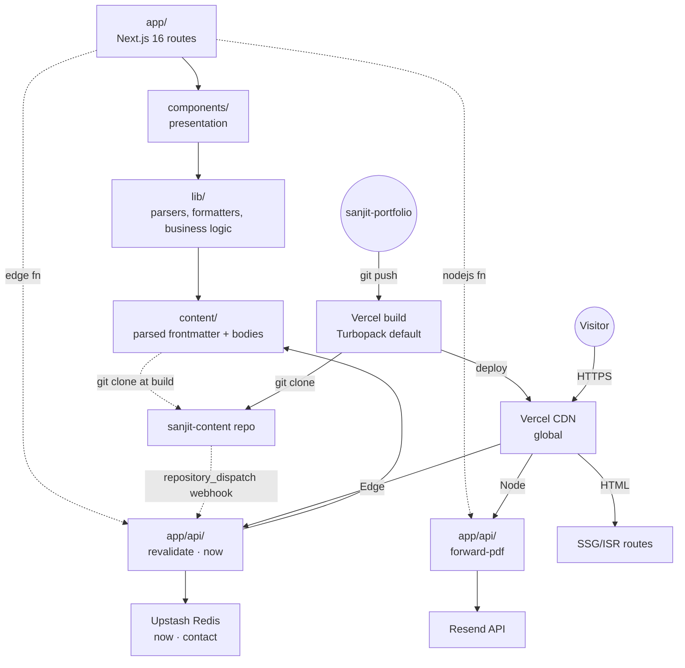
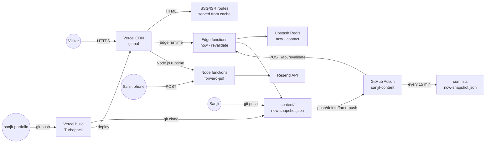

# Architecture Spine — Sanjit Majumdar's Engineering Portfolio

## Design Paradigm

**Static-first with edge-rendered islands.** Every public route is a server-rendered HTML document, statically generated (SSG) or revalidated on demand (ISR). Client JavaScript ships only where it earns weight: the recruiter-mode toggle, the forward-modal, the pattern anchor scroller, the deferred analytics/error beacons, and the `interactive: true` Lab tool iframes. The model is "the page is the asset; JS is decoration on top." Performance budgets are a hard ceiling, not a target — Lighthouse Performance ≥ 95 in CI, homepage ≤ 100 KB gzipped, every other route ≤ 200 KB gzipped, LCP < 1.8s on Slow 4G.

This paradigm names two layers automatically:

- **Document layer** (`app/` in Next.js App Router): server-rendered routes, RSC by default, no client JS unless a component opts in with `"use client"`.
- **Island layer** (`components/client/`): the closed set of client components declared in AD-13; imported only by the routes that render them.

A future builder can read every file in `app/` and trust it ships zero JS by default. A client component earns its place by being the only way to deliver a documented interactive surface (toggle, modal, scroll behavior).

## Inherited Invariants

Inherited read-only from PRD §11 Constraints and Guardrails and Spec §Constraints. Never re-derived.

| Inherited | From parent | Binds here |
| --- | --- | --- |
| Vercel-hosted frontend + serverless functions only | PRD §11, SPEC constraint 1 | All infrastructure decisions; no external infra |
| No always-on DB | PRD §11, SPEC constraint 2 | Upstash Redis via Vercel Marketplace for ephemeral state only; content lives in git |
| Static-first rendering | PRD §11, SPEC constraint 3 | The paradigm itself |
| Additive content schema (Zod `.partial()` + `.passthrough()`) | PRD §11, SPEC constraint 4, FR-13 | All content ingestion paths |
| Lighthouse Performance ≥ 95 in CI | PRD §11, SPEC constraint 5 | All build outputs |
| Route-level invariant: spine-line + proof-number + return-path | PRD §11, SPEC constraint 6, FR-10 | Every public route |
| Pattern is a first-class content type with stable deep-link URLs | SPEC constraint 7 | Content schema + routing |
| No paid third-party services in critical rendering path | PRD §11, SPEC constraint 4 | All CSP + script-loading decisions |

## Invariants & Rules

The durable heart. Fourteen ADs, ascending ids, never renumbered. All ADs verified against the current state of the web (2026-09-23 baseline) and the adversarial two-units-attack lens. Each AD is prescriptive, not descriptive — two builders reading these rules will produce compatible systems.

### AD-1 — Content source-of-truth and read path `[CARRYOVER, NO-AMENDMENT]`

- **Binds:** FR-12, FR-13, FR-14, CAP-5
- **Prevents:** Divergence between routes that read content via git-clone vs. routes that hit the GitHub API directly. Two paths to the same file = two drift points.
- **Rule:** Static content lives in a single git repository (`sanjit-content`). The Next.js build step shallow-clones it into the build container; every published route reads from that clone. Content edits push to `main`; a GitHub Action in `sanjit-content` listens to `push`, `delete`, and force-push events and calls `POST /api/revalidate?tag=<tag>[&slug=<slug>][&sha=<sha>]`. The serverless handler constructs the full ISR tag as `<tag>:<slug>` when `slug` is present, or `<tag>` alone when absent. The enumerated bare tags are `now` and `cv`; the enumerated typed tags are `case-study`, `pattern`, `lab`, `project`. The handler calls `revalidateTag(tag, 'max')` (Next 16 signature) on the affected route. No route may read content via the GitHub HTTP API at runtime.

### AD-2 — Live state store split (closed namespace list) `[CARRYOVER, NO-AMENDMENT]`

- **Binds:** FR-15, FR-17, CAP-6
- **Prevents:** (a) Divergence where one consumer reads the currently-building feed from KV and another reads from the content repo's `now-snapshot.json` for the same field; (b) addition of an unauthorized KV namespace that creates a second owner of an entity already owned by the content repo.
- **Rule:** Vercel KV is no longer available; this AD uses **Upstash Redis via Vercel Marketplace** (Redis-compatible; same API surface). The Upstash Redis instance holds exactly **two namespaces**: `now` (currently-building entries, phone-editable) and `contact` (contact-form queue). Static content and the `/now` last-good snapshot live in the content repo. KV is the cache; the content repo is the source. **Adding any namespace beyond `now` and `contact` requires a spine amendment.** The currently-building entry shape is canonical: `{ id: string, title: string, body_md: string, updated: ISO8601 }`. The snapshot file shape is canonical: `{ entries: Entry[], last_updated: ISO8601 }` where `last_updated = max(entries[].updated)`. CV lives only in `cv.md` in the content repo; no KV mirror of CV is permitted.

### AD-3 — Serverless runtime split (closed endpoint list) `[CARRYOVER, NO-AMENDMENT]`

- **Binds:** FR-6, FR-17, NFR-P
- **Prevents:** (a) Divergence where someone deploys a chromium-dependent endpoint as edge (chromium cannot run on edge); (b) addition of unauthorized serverless endpoints; (c) static routes pinned to a non-default region (slow first paint for non-US visitors).
- **Rule:** All static (SSG/ISR) routes serve from Vercel's default region via the global CDN. The serverless endpoints in v1 form a **closed set**:
  - `GET /api/now` — **edge runtime** — reads from Upstash Redis + snapshot, returns the canonical payload (AD-10).
  - `POST /api/forward-pdf` — **Node.js runtime** (`export const runtime = 'nodejs'`, `export const maxDuration = 60`, allocated ≥ 1769 MB) — runs Puppeteer via `@sparticuz/chromium`. The PDF generator cannot run on edge; chromium requires Linux Node.
  - `POST /api/revalidate` — **edge runtime** — called by the content-repo webhook; calls `revalidateTag(tag, 'max')`.
  Adding any endpoint requires a spine amendment. Seeding KV from the content repo's snapshot happens at build time (when the content is cloned and parsed), never via a runtime endpoint.

### AD-4 — Pattern citation resolution at build (published-set only)

- **Binds:** FR-8, FR-9, CAP-3
- **Prevents:** (a) Divergence where two case studies cite the same pattern but surface different moves, or where a typo'd slug renders a dead link; (b) build breaking on a draft case study that cites a draft pattern.
- **Rule:** Pattern citations in case-study frontmatter (`patterns: ["canonical-model"]`) resolve at build time by string-match against the `patterns/` directory's published slugs. Each citation may override the surfaced move via `pattern_moves: { "canonical-model": 3 }`; the default is `move-1`. **The citation walker walks only entries with `status === 'published'`** — drafts do not run through the citation resolver. The published-set is the union of published entries across all content types. The build fails (per AD-5) if any cited slug is unpublished. Case-study pages render the citations as a "Patterns cited" section at the bottom (per addendum §A.6 Option C).

- **[AMENDED 2026-09-23 v4-ux]** The `/patterns/[slug]` route renders the signature-canvas **decision-graph** mode (`decision-graph (4 moves + warn counter)` per `DESIGN.md.components.sig-canvas.modes`, see AD-17) with `M1..Mn` numbered moves, each anchor-linkable via native HTML heading IDs (e.g. `/patterns/canonical-model#move-3`). The `counter-line` block is visually distinct from the moves per `EXPERIENCE.md.State Patterns` (`--colors.warn` left border 3px, `--foreground-2` body, label "When NOT to use it") so a screen-reader scanning the page lands on a clearly different surface, not a soft continuation. The native anchor mechanism replaces the v4 `<PatternAnchorScroller>` client component — that component is removed from the closed client-component set in AD-13. The citation walker mechanism itself is unchanged; only the rendered surface changed.

  **Heading-ID contract (binding):** (a) Every move heading renders as `<h2 id="move-{N}">` where `{N}` is the 1-indexed move position (`move-1`, `move-2`, `move-3`, `move-4`). Case-study pattern citations link to this exact form (`/patterns/canonical-model#move-3`), NOT to `M1`, `#m1`, or `#M3`. (b) The `counter-line` block renders as `<h2 id="when-not">` (kebab-case, not numbered). (c) Other headings on the page (the page title, subsections within a move, "Why this works", "When to use it") get slugger-generated ids (`<h2 id="why-this-works">` via MDX's default `rehype-slug`), and are NOT linked from case-study pattern citations — only `move-{N}` is. (d) Only the `move-{N}` and `when-not` heading ids are bound by this AD; all other heading ids on the page are the MDX layer's responsibility (no builder needs to coordinate on them).

### AD-5 — Malformed-frontmatter error model `[CARRYOVER, NO-AMENDMENT]`

- **Binds:** FR-13, NFR-C
- **Prevents:** Divergence where a broken entry ships and the build silently renders an empty field.
- **Rule:** Every published entry (`status === 'published'`) must pass `Zod.safeParse()` against its content-type Zod 4 schema. Build exits non-zero on any failure with a per-file diagnostic that includes the file path and the failing field (using Zod 4's `ZodError.issues` shape). `draft` entries may have malformed frontmatter and render in preview only. The Zod schema uses `.partial({ title: true })` and `.passthrough()`; the latter exposes unknown keys on `entry.meta`.

### AD-6 — Live architecture diagram sync

- **Binds:** CAP-7, architecture-diagrams companion
- **Prevents:** Divergence between the deployed "How this site is built" diagram and the actual deployed system.
- **Rule:** The "How this site is built" page renders an MDX-embedded React component that reads `architecture-diagrams.md` from the spec-companions folder at build time and renders the text-art diagrams as styled SVG with hover details and click affordances. The companion file is the source of truth; the React component is a thin renderer. When the architecture changes, the companion changes, the content webhook fires (per AD-1), the page revalidates. The diagram never drifts from reality because the diagram and the architecture share a source.

- **[AMENDED 2026-09-23 v4-ux]** The same architecture diagram is rendered at two scales on `/built`: (a) a big version in the hero right column (`{components.card-focal}` per `DESIGN.md`) and (b) a small version in the persistent 240×240 signature-canvas slot (top-right, ≥1280px viewport, see AD-17). Both scales must stay in sync with the same 7-layer source-of-truth enumeration in `architecture-diagrams.md`. v4 binds a second co-source: the signature-canvas mode table in `DESIGN.md.components.sig-canvas.modes` (specifically the `built (layered architecture)` mode entry). When either source changes, both must change together; the companion file and the canvas-mode table are co-sources for the same diagram. Layer-row hover-sync (table row ↔ diagram node, big + small) is implemented by `<LayerRowHover>` (AD-13) and `prefers-reduced-motion` short-circuits the class swap. The canonical diagram's layer count is **7** (`AD-13 (now), AD-14 (recruiter-route forward flow), AD-17 (signature canvas), AD-18 (design tokens), AD-19 (breakpoints), AD-20 (a11y floor), AD-1 (content)` — refreshed when ADs are added). The hero big version and the signature-canvas small version must enumerate the same 7 layers in the same order; AD-12's CI assertion verifies the small version's HTML contains the literal `layered-architecture` mode id.

### AD-7 — Forward-PDF generation (Node.js runtime) `[CARRYOVER, NO-AMENDMENT]`

- **Binds:** FR-4, FR-6, CAP-2
- **Prevents:** Divergence where the recruiter sees no PDF and the forward fails, or where the visual fidelity of the PDF doesn't match the live page.
- **Rule:** The PDF forward artifact is generated at `POST /api/forward-pdf?case=<slug>` (Node.js serverless function per AD-3, allocated ≥ 1769 MB) via Puppeteer using `@sparticuz/chromium`. The function navigates to `https://sanjit.dev/recruiter?forward=1&case=<slug>` (per amended AD-14) and returns a single-page A4 PDF containing spine line + four proof vectors + one recommended case study + canonical site URL footer. Cold-start budget: 4 seconds. If the function times out (default Vercel Hobby `maxDuration` ceiling; configured to 60s) or Chromium fails to launch, the secondary link on `/recruiter` falls back to client-side `window.print()` (amended AD-14) using a print-only stylesheet that lives on the `/recruiter` route and produces an equivalent layout. PDF cannot run on edge; the runtime is Node.js (per AD-3).

### AD-8 — Deterministic recruiter-mode state (URL precedence)

- **Binds:** FR-3, CAP-1, CAP-2
- **Prevents:** (a) Divergence where the same visitor sees different recruiter-mode states across pages; (b) the URL `?for=recruiter` losing to localStorage on a forwarded link, which would break CAP-2's cold-link legibility; (c) recruiter-mode-aware HTML not being in the initial server-rendered HTML (Slack unfurl vs. landing-page mismatch).
- **Rule:** Recruiter-mode has the following deterministic precedence: (1) **URL param wins** when present — `?for=recruiter` forces recruiter-mode on regardless of localStorage; (2) **otherwise** localStorage `for_recruiter === 'true'` applies; (3) otherwise default mode. The server component reads the URL param at request time via `searchParams` and renders the recruiter-mode-aware hero in the initial HTML (this is required so Slack/Gmail unfurl and direct loads show the correct first paint). The `<RecruiterModeProvider>` client component initializes its context to match the server-rendered value, then writes both `localStorage` and the URL via `history.replaceState` on toggle. No server hit on toggle. No behavior-derived prediction. No timestamp-based precedence.

- **[AMENDED 2026-09-23 v4-ux — most consequential]** Recruiter-mode is **a route, not a client state**. The `<RecruiterModeProvider>`, `<RecruiterModeToggle>`, and `localStorage.for_recruiter` flag are **removed entirely**. The URL `?for=recruiter` maps to a dedicated SSG route `app/recruiter/page.tsx` which renders the v4 recruiter surface: spine line + four proof vectors + status strip (Available · Remote-first · Open to relocation · Last updated YYYY-MM-DD) + 2×2 stat grid + experience timeline + role-fit cards + closing CTA. The rest of the site does NOT switch modes — the visitor is routed to `/recruiter` via the footer-level opt-in link `For recruiters?` on every page (rendered as plain HTML, no client JS). The URL `?for=recruiter` remains the canonical share form for the forward artifact (see amended AD-14): the recipient lands on `/recruiter?forward=1&case=<slug>` with the recruiter-mode-aware hero on first paint because the route is SSG with `generateStaticParams` per slug, and `generateMetadata` reads `searchParams` at request time to set og:image. The recruiter-route signature canvas uses `--colors.live` (green) per `DESIGN.md.components.sig-canvas.modes` — visually distinct from every other page's violet to signal "status surface, not brand surface." Prevents the divergence where two builder units each implement a different "recruiter-mode" surface (one as a client toggle, one as a route) and the recipient's first paint drifts from the og:image unfurl preview.

### AD-9 — Build pipeline does not run on content edits `[CARRYOVER, NO-AMENDMENT]`

- **Binds:** FR-12, FR-14, CAP-5, SM-5
- **Prevents:** Divergence where content edits trigger code builds and burn CI minutes / cold starts unnecessarily.
- **Rule:** The main Next.js build pipeline runs only on changes to the code repo (`sanjit-portfolio`). Content edits to `sanjit-content` trigger only `revalidateTag()` via webhook (per AD-1) — never a new build. Enforced via: separate GitHub Actions workflows on the two repos, separate Vercel deployment triggers (content repo → no Vercel hook; webhook handler calls `revalidateTag(tag, 'max')` on the deployed site directly), and a weekly CI audit that fails if any Vercel deployment in the past 7 days was triggered by a content-repo commit. The 5-minute TTL fallback (FR-14) covers webhook delivery failure.

### AD-10 — Stale-state fallback contract (canonical payload) `[CARRYOVER, NO-AMENDMENT]`

- **Binds:** FR-15, FR-16, FR-17, CAP-6
- **Prevents:** (a) Divergence where the homepage "currently building" section silently shows nothing while `/now` shows the last-good snapshot; (b) the handler returning an empty array without signaling fallback; (c) entry-shape mismatch between KV writes and the snapshot file (per AD-2 amendment).
- **Rule:** `GET /api/now` (edge function per AD-3) reads from Upstash Redis (per AD-2). If KV returns no entries OR the most-recent entry's `updated` timestamp is older than 7 days, the handler returns `{ entries: <from /content/now-snapshot.json>, fallback: true, last_updated: <ISO from snapshot> }`. The handler **never** returns `{ entries: [] }` without also returning `fallback: true`. Consumers (homepage, `/now`) render a visible `(last updated N days ago)` tag whenever `fallback` is true. The 7-day gate is computed against each entry's `updated` field; `last_updated` equals `max(entries[].updated)`. Phone-edits to the currently-building feed write to KV only; a GitHub Action in `sanjit-content` runs every 15 minutes, reads the latest KV state, and commits `now-snapshot.json` to the content repo's main branch. The snapshot is therefore always KV-derived, never hand-edited. No serverless function pushes to the content repo.

### AD-11 — Strict CSP and no third-party JS on critical path `[CARRYOVER, NO-AMENDMENT]`

- **Binds:** FR-22, NFR-P, NFR-S
- **Prevents:** Divergence where someone adds an analytics script inline or via `<script src="https://cdn.example.com">` and breaks the LCP budget or introduces an XSS surface.
- **Rule:** `next.config.js` sets a Content-Security-Policy header with: `default-src 'self'`; `script-src 'self' 'nonce-<runtime>' https://plausible.io`; `style-src 'self'` (SRI via `experimental.sri: { algorithm: 'sha256' }` enables hash-based integrity for built CSS, removing the need for `'unsafe-inline'` while preserving SSG/ISR); `img-src 'self' data:`; `connect-src 'self' https://plausible.io https://api.resend.com`; `frame-src 'self' https://*.sanjit.dev` (Lab tool iframes). All third-party scripts load via `next/script` with `strategy="lazyOnload"` only. Plausible is the only analytics provider; Sentry's client SDK loads deferred and only sets `connect-src` for its ingest endpoint. The nonce path (which would require `proxy.ts` and force dynamic rendering) is explicitly rejected because it is incompatible with the static-first paradigm and AD-13's no-global-client-provider rule.

### AD-12 — Route-level invariants enforced in CI

- **Binds:** FR-10, FR-11, CAP-4
- **Prevents:** Divergence where a new route ships without the spine-line + proof-number + return-path treatment, breaking the decentralized-page-as-proof surface.
- **Rule:** Every PR runs three CI assertions against the built output: (1) **spine-line invariant** — every URL under `/`, `/work/*`, `/projects/*`, `/lab/*`, `/patterns/*`, `/now`, `/about` contains the spine-line variant string in the rendered HTML; (2) **proof-number invariant** — every such URL contains at least one of `7+`, `10K+`, `35%`, `7-person`; (3) **return-path invariant** — every such URL contains a navigation link with `href="/"` or `href="https://sanjit.dev"`. Failing any assertion fails the build.

- **[AMENDED 2026-09-23 v4-ux]** (a) The route list expands: `/recruiter`, `/built`, and the `404` page are in scope alongside the routes listed above. (b) The **proof-number set** is expanded to the v4-UX full set: `{7+, 10K+, 35%, 22h, 1.2M, −68%, 7-person, 6, 8+ years}`. v4 identifies these specific numbers as the four proof vectors per `DESIGN.md.Identity` and `EXPERIENCE.md.Flow 1`: "1.2M patients served, −68% P95 latency, 22h MTTR, 6 engineers mentored." The expanded set covers both the legacy four (7+, 10K+, 35%, 7-person) and the v4 four (1.2M, −68%, 22h, 6) plus the year claim (8+ years). Any URL passes if it contains at least one element of the expanded set. (c) The **spine-line variants** are expanded per `EXPERIENCE.md.Voice and Tone`: "This person builds serious software — and this website is proof." (homepage, recruiter-route hero) / "Walked into the build notes anyway." (built-page hero) / "the gap annoyed me." (lab-page hero) / "right now." (now-page hero) / "Skip the scheduling dance. Reply with role + comp range." (recruiter-route closing CTA) / per-page positioning variants. The CI assertion accepts any of these variants per route. (d) The `/built` page gets a **special-case assertion** that its HTML contains a `<SignatureCanvas data-sig-canvas-mode="layered-architecture">` element (the `data-sig-canvas-mode` attribute is the binding contract — see AD-17), preventing the divergence where the big hero diagram and the signature-canvas small diagram drift onto different layer enumerations. The CI assertion checks for the attribute name AND the value `layered-architecture` (regex: `data-sig-canvas-mode=["']layered-architecture["']`); prose copy that happens to contain the string is not a substitute. (e) The `404` page must still carry the spine-line variant + a proof number + a return path; the variant "right now." (with an honest empty-state reading) is the recommended default if the page is reached mid-edit. (f) **Stale-bookmark redirect:** `proxy.ts` (AD-11) issues a single 308 redirect from `/?for=recruiter*` to `/recruiter*` (preserving any query params), so a forwarded `/?for=recruiter&forward=1&case=<slug>` URL resolves to `/recruiter?forward=1&case=<slug>`. This is the only recruiter-related redirect; the rule is "one canonical URL, one canonical route" per amended AD-8.

### AD-13 — No SPA shell, island-only hydration (closed client-component set)

- **Binds:** FR-19, FR-20, FR-22, NFR-P
- **Prevents:** Divergence where a future builder wraps pages in a layout-level client provider (e.g., for shared state, theming, or routing) and re-introduces global hydration, blowing the JS budget.
- **Rule:** The site has no global client provider, no SPA shell, no layout-level `"use client"` boundary. Each route is a server component by default. Client components live in `components/client/` and each file begins with `"use client"`. The set of client components is **closed**: `<RecruiterModeToggle>`, `<ForwardModal>`, `<PatternAnchorScroller>`, `<LabToolIframeLoader>` (renders only when `interactive: true`), `<AnalyticsBeacon>` (loads Plausible), `<ErrorBeacon>` (loads Sentry). Adding a new client component requires updating this list in the spine. The bundle is split per-route; the homepage's first-paint JS includes only `<RecruiterModeToggle>` + `<AnalyticsBeacon>` (lazy) + `<ErrorBeacon>` (lazy). `middleware.ts` references are renamed to `proxy.ts` (Next 16 convention). Interactive primitives used by these client components (`Dialog`, `Toggle`, `Tooltip` from shadcn/ui) live in `components/ui/` per AD-15 and are imported only by the components that mount them — they are not a general-purpose library.

- **[AMENDED 2026-09-23 v4-ux]** The closed client-component set is **revised** to bind v4's behavioral surface. **Removed (4):** `<RecruiterModeToggle>` (recruiter-mode is a route per amended AD-8, not a client state), `<ForwardModal>` (forward artifact is a route-level flow per amended AD-14, not a modal), `<LabToolIframeLoader>` (v4 Lab mockup renders tools as plain HTML iframes or static screenshots with no client JS — the iframe wrapper is a server-rendered `<iframe>` tag), `<PatternAnchorScroller>` (pattern page uses native HTML anchors via `M1..Mn` heading IDs per amended AD-4 — zero client JS). **Added (8):** `<SignatureCanvas>`, `<ScrollProgress>`, `<CommandPalette>`, `<MagneticCTA>`, `<LayerRowHover>`, `<SkipToContent>`, `<NavCurrent>`, `<FilterChipGroup>`. **Carried (2):** `<AnalyticsBeacon>` (Plausible, lazyOnload), `<ErrorBeacon>` (Sentry, deferred). **Closed set (10 total):**

  | Component | Lives in | Mounts on | Motion gate |
  | --- | --- | --- | --- |
  | `<SignatureCanvas>` | `components/client/` | every route (≥1280px viewport); selects one of 9 enumerated modes per AD-17 | `prefers-reduced-motion` collapses the `sigFlow` dash-offset idle animation to 0.01ms |
  | `<ScrollProgress>` | `components/client/` | the persistent nav on every route | `prefers-reduced-motion` disables the scroll listener |
  | `<CommandPalette>` | `components/client/` | the persistent nav on every route; opened by ⌘K / Ctrl-K | `prefers-reduced-motion` collapses the open transition to 0.01ms |
  | `<MagneticCTA>` | `components/client/` | exactly one focal primary CTA per page (nav or hero) | `pointer:fine AND NOT prefers-reduced-motion` |
  | `<LayerRowHover>` | `components/client/` | the layer table on `/built` | `prefers-reduced-motion` short-circuits the class swap |
  | `<SkipToContent>` | `components/client/` | the first focusable element on every route | none (pure focus CSS) |
  | `<NavCurrent>` | `components/client/` | the persistent nav on every route | none (sets `aria-current="page"` on initial render + handles client-side nav) |
  | `<FilterChipGroup>` | `components/client/` | `/work` only | none — `aria-pressed` swap only; the filter does not actually filter in v4 (visual organization per `EXPERIENCE.md`) |
  | `<AnalyticsBeacon>` | `components/client/` | root layout; loads Plausible via `next/script strategy="lazyOnload"` | n/a (no UI motion) |
  | `<ErrorBeacon>` | `components/client/` | root layout; loads Sentry deferred | n/a (no UI motion) |

  shadcn/ui primitives from AD-15 (`Dialog`, `Toggle`, `Tooltip`) live in `components/ui/` per AD-15 and are imported only by the components that mount them. v4 does **not** add any new shadcn primitives; the closed set in AD-15 is unchanged. Adding any new client component to this list requires a spine amendment (AD-16's reviewer contract applies — any reviewer recommendation to add a new client component is logged as deferred unless it also updates this AD).

### AD-14 — Forward-modal URL contract (button hierarchy)

- **Binds:** FR-4, FR-5, FR-11, CAP-2
- **Prevents:** (a) Divergence between the shareable URL form and the live page render; (b) divergence between the link-preview metadata (Slack/Gmail unfurl) and the actual page content; (c) divergent interpretations of which affordance is "primary" when both URL and PDF exist; (d) the recipient landing on a page whose initial HTML doesn't match the og:image (per AD-8's first-paint fix).
- **Rule:** The forward-modal generates a single URL shape: `https://sanjit.dev/?for=recruiter&forward=1&case=<slug>`. The `forward=1` query param drives a `generateMetadata` switch that reads `searchParams` at request time and sets `og:title`, `og:description` (spine line + four proof vectors), and `og:image` (the forward-artifact social card, 1200×630). **Button hierarchy in the modal:** the shareable URL is the **primary affordance** — "Copy URL" button, top of modal, default focus; the PDF download is the **secondary affordance** — "Download PDF" button below the URL. When Puppeteer fails (per AD-7), the secondary button mutates into a "Print via browser" link that triggers `window.print()`. The URL is the canonical share form; the PDF is the fallback for networks that block share-URL previews. Server-side rendering honors `?for=recruiter` for the initial HTML (per AD-8) so that the unfurl preview and the landing page agree on first paint.

- **[AMENDED 2026-09-23 v4-ux — rewritten]** The forward artifact is **a route-level forward flow, not a modal**. The URL shape becomes `https://sanjit.dev/recruiter?forward=1&case=<slug>` (hosted at `app/recruiter/page.tsx`, see amended AD-8). The recipient lands on `/recruiter` with the recruiter-mode-aware hero on first paint: spine line + four proof vectors + status strip + the recommended-case-study callout (driven by `?case=<slug>`). `generateMetadata` reads `searchParams` at request time and sets `og:title` (forward variant), `og:description` (spine line + four proof vectors), and `og:image` (1200×630 social card). The **affordance hierarchy is URL-first, PDF-second**, but no longer gated by a modal's button order — it is implemented as two links on the `/recruiter` route: (a) **primary affordance** — a "Copy URL" link / button at the top of the closing CTA card, default focus on page load; (b) **secondary affordance** — a "Download PDF" link from `/api/forward-pdf?case=<slug>` (existing AD-7 Puppeteer route, mechanism unchanged). When Puppeteer fails (per AD-7), the secondary link mutates into a "Print via browser" link that triggers `window.print()` on the `/recruiter` route — the print stylesheet lives on the route, not on a now-deleted modal. The URL is the canonical share form; the PDF is the fallback for networks that block share-URL previews. The `<ForwardModal>` client component is removed from AD-13's closed set. The recruiter-route signature canvas uses `--colors.live` (green) per `DESIGN.md.components.sig-canvas.modes`, visually distinct from every other page's violet, signaling "this is the status surface, not the brand surface."

### AD-15 — shadcn/ui for interactive primitives only (closed surface) `[CARRYOVER, NO-AMENDMENT]`

- **Binds:** FR-3, FR-4, FR-6, NFR-A, NFR-P
- **Prevents:** (a) Divergence where one client component rolls its own focus trap + ARIA and ships subtly broken keyboard/screen-reader behavior; (b) scope creep where shadcn becomes the default for every styled component, dragging a full design system into the JS bundle; (c) two builders reaching for different shadcn recipes for the same component and producing inconsistent keyboard behavior.
- **Rule:** Use shadcn/ui (Radix-based primitives copied into `components/ui/`) for **exactly three interactive primitives**: `Dialog` (the ForwardModal body — focus trap, escape-to-close, scroll lock, screen-reader announcements), `Toggle` (the RecruiterModeToggle — pressed-state ARIA), and `Tooltip` (the "Patterns cited" deep-link cards — hover/focus disclosure on the case-study page). The shadcn components are imported only by the routes that mount them; they do not appear in `components/ui/` as a general-purpose library. All other components — `Hero`, `PositioningHeader`, `ProofVectorCluster`, case-study body, pattern page, `/now` feed rendering — are hand-rolled Tailwind v4 components because they carry the spine line's typographic treatment and need direct visual control. shadcn ships no `<script>` and is CSP-compatible with AD-11 (no new origins, no inline scripts); the Radix primitives add per-component weight only when the component mounts, so the homepage budget is unaffected unless `<ForwardModal>` is open. Any new shadcn primitive requires updating this list in the spine; any new hand-rolled component does not.

### AD-16 — Visual-design and microcopy AI skills as reviewers, not authors

- **Binds:** NFR-A, AD-11, AD-12, AD-13, AD-14, AD-15
- **Prevents:** (a) A visual-design AI skill introducing animated decorative JS that breaks CAP-7's perf budget (e.g., animated number counters for proof vectors); (b) the spine line losing its typographic primacy because a "more visual hierarchy" recommendation is adopted; (c) AD-14's button hierarchy being reshuffled by a "best-practice UI" suggestion; (d) AD-12's route-level invariant being weakened by a "carousel for case studies" suggestion; (e) decorative motion being added that violates `prefers-reduced-motion` handling under NFR-A.
- **Rule:** Visual-design and microcopy AI skills (UI/UX review, accessibility audit, typography critique, microcopy polish — including any "ui ux pro max" or "impeccable" class of skill) may be consulted at any point in the build, but their output is **review notes**, not spine amendments. Their output is captured to `{doc_workspace}/reviews/design-review-{slug}.md` (the same scratch-folder convention used by architecture reviewers). A recommendation that would (a) add client-side JS beyond the closed set in AD-13, (b) change the spine line copy (which is fixed per SPEC Why + PRD §3), (c) reorder the ForwardModal button hierarchy fixed by AD-14, (d) break AD-12's route-level invariant (every public route is standalone, not a carousel or tab surface), or (e) introduce motion that does not honor `prefers-reduced-motion` is logged as a **deferred item** in the memlog with the conflicting AD cited, and is **not adopted**. Design skills may refine, may not override. When a skill surfaces a real conflict with the spine, the resolution is a spine amendment that goes through the reviewer gate, not a silent override at the build layer.

- **[AMENDED 2026-09-23 v4-ux]** v4 introduces **8 distinct motion surfaces** that did not exist before v4, plus 2 carryover surfaces (card hover lift, ticker-row hover). The motion surface table is the binding contract:

  | Motion surface | Where it lives | `prefers-reduced-motion` gate | `pointer:fine` gate | Final-state guarantee |
  | --- | --- | --- | --- | --- |
  | Magnetic CTA displacement | `<MagneticCTA>` (AD-13) | disable entirely (component short-circuits to a static button) | **required** — touch / pen users see a static button | Static button, focusable, same label |
  | Signature-canvas `sigFlow` dash-offset | `<SignatureCanvas>` (AD-13, AD-17) | collapse to 0.01ms | n/a | Static diagram with all active edges visible |
  | Scroll-progress bar transform | `<ScrollProgress>` (AD-13) | disable scroll listener (bar pinned at 0%) | n/a | Bar at 0%; no visible motion |
  | Command-palette scrim fade | `<CommandPalette>` (AD-13) | collapse to 0.01ms | n/a | Modal opens/closes instantly; focus trap still works |
  | Layer-row hover-sync | `<LayerRowHover>` (AD-13) | short-circuit the class swap | hover listeners are pointer-gated by `pointer:fine` implicitly | No swap; all rows visible in static state |
  | Filter-chip `aria-pressed` swap | `<FilterChipGroup>` (AD-13) | n/a — `aria-pressed` is an ARIA attribute, not a motion | n/a | Pressed state still applies (this is a state, not motion) |
  | Card hover lift (general CSS hover) | every card surface | disable `transform` and `box-shadow` transitions | `pointer:fine` (CSS `@media (hover: hover)`) | Static card; no lift |
  | Ticker-row hover (general CSS hover) | `/now` row surface | disable `background-color` transitions | `pointer:fine` (CSS `@media (hover: hover)`) | Static row; no color shift |
  | Magnetic focus ring (`<MagneticCTA>` `:focus-visible`) | `<MagneticCTA>` (AD-13) | disable transform | n/a (focus is keyboard, not pointer) | Static focus ring |
  | Skip-link `:focus` slide-in | `<SkipToContent>` (AD-13, AD-20) | collapse transition to 0.01ms | n/a | Link visible at `top: 1rem` immediately on focus |

  All 10 must honor `prefers-reduced-motion: reduce` (collapse animation/transition durations to 0.01ms or disable entirely). Where motion depends on pointer fidelity (rows 1, 7, 8), the surface must additionally gate on `pointer:fine` — implemented via CSS `@media (hover: hover) and (pointer: fine)` for CSS-driven surfaces, or `matchMedia('(pointer: fine)')` for JS-driven surfaces. A reviewer recommendation that introduces a new motion surface OR removes any of the gates above is logged as a **deferred item** in the memlog with conflicting AD-13 + AD-20 cited, and is **not adopted**. The "ForwardModal button hierarchy" conflict clause (c) is updated to reference amended AD-14's route-level hierarchy on `/recruiter` (the modal is gone). The spine-line copy clause (b) is updated to reference v4's expanded variant set per amended AD-12 (the spine-line string is no longer a single fixed quote but a closed set of variants per `EXPERIENCE.md.Voice and Tone`); reviewer recommendations may refine within that closed set, may not change which strings are in the set.

### AD-17 — Signature canvas closed mode list `[NEW 2026-09-23 v4-ux]`

- **Binds:** `DESIGN.md.components.sig-canvas.modes`, amended AD-4 (pattern page decision-graph mode), amended AD-6 (built-page layered-architecture mode), amended AD-8 (recruiter-route live-green mode), AD-12 (CI special-case assertion for `layered-architecture` mode id on `/built`), AD-13 (`<SignatureCanvas>` component), AD-20 (aria-hidden + reduced-motion on the canvas)
- **Prevents:** Divergence where (a) two routes pick the same canvas mode by accident (e.g., home and work both rendering `dual-ring`), (b) one route renders the canvas with an unstated active-accent color (the canvas mode table defines which accent each mode uses), (c) two routes pick divergent visual treatments of the same content surface (e.g., `/work` rendering the `experiment-graph` mode by mistake), (d) the `/built` page big-version diagram and signature-canvas small-version diagram drift onto different layer enumerations (the mode id `layered-architecture` is the bridge — it is the same mode at two scales).
- **Rule:** The 9 signature-canvas modes are enumerated and **closed**. Each route renders exactly one mode. The mode table (source: `DESIGN.md.components.sig-canvas.modes`) is the binding reference. Every route in the structural seed appears in the table — there is no "no canvas" route for a page that exists; the slot simply renders with `display: none` below `xl` per AD-19:

  | Mode id | Route | Active accent | Notes |
  | --- | --- | --- | --- |
  | `dual-ring` | `/` (homepage) | `--accent` (violet) | Dual-ring with central thinking hub. |
  | `filter-graph` | `/work` | `--accent` (violet) | All / Lead / Civic / Eng filter graph. |
  | `section-progress` | `/work/[slug]` (case study) | `--accent` (violet) | 6 vertical nodes matching case-study sections. |
  | `timeline` | `/projects/[slug]` | `--accent` (violet) | Re-uses the `timeline` mode (case studies and projects share the same vertical-node visualization; differs only in section count). |
  | `decision-graph` | `/patterns/[slug]` | `--accent` (violet) | 4 moves + warn counter; pairs with the `counter-line` block per amended AD-4. |
  | `decision-graph` | `/patterns` (index) | `--accent` (violet) | Same mode as the individual pattern page; index renders the mode with collapsed nodes (no per-pattern moves). |
  | `experiment-graph` | `/lab` and `/lab/[slug]` | `--accent-3` (pink) | Idea hub + 4 corners; uses `--accent-3` only on this route per `DESIGN.md.Color Discipline`. The `/lab/[slug]` page re-uses the same mode (the lab tool's own UI is below the canvas in the main column). |
  | `activity-feed` | `/now` | `--accent` (violet) | 3 active + 3 prior nodes. |
  | (none — no canvas) | `/now/feed.xml` | n/a | RSS / Atom feed; XML content, no signature canvas. `app/now/feed.xml/route.ts` returns `Content-Type: application/atom+xml`; the canvas component is not rendered. |
  | `timeline` | `/about` | `--accent` (violet) | 5 vertical nodes. |
  | `layered-architecture` | `/built` | `--accent-2` (cyan) | 7 stacked layers; same diagram at two scales per amended AD-6. CI asserts `data-sig-canvas-mode="layered-architecture"` attribute per AD-12 special case. |
  | `condensed-4-node-status` | `/recruiter` | `--colors.live` (green) | 4-node status graph; uses `--colors.live` to signal status surface, not brand surface. |
  | (none — no canvas) | `/404` (`not-found.tsx`) | n/a | The 404 page is intentionally canvas-less — the empty signature-canvas slot is what visually signals "lost" to a returning visitor. The page still carries the spine-line variant + proof number + return path per AD-12. |

  Idle animation: `stroke-dasharray: 4 4` traversing active edges at 2s linear infinite (`sigFlow`). `prefers-reduced-motion` collapses the idle animation to 0.01ms; the static diagram remains. `<SignatureCanvas>` (AD-13) is `aria-hidden="true"` and `pointer-events: none` per AD-20. The slot is `display: none` below the `xl` breakpoint per AD-19. Adding a new mode requires a spine amendment (closes the list of modes).

### AD-18 — Closed design token set `[NEW 2026-09-23 v4-ux]`

- **Binds:** `DESIGN.md.Colors` / `Typography` / `Spacing` / `Shapes` / `Shadow`, AD-13 (`<SignatureCanvas>` reads `--accent` / `--accent-2` / `--accent-3` / `--colors.live` per AD-17), AD-17 (mode-to-accent mapping), AD-20 (a11y contrast floor on token usage), amended AD-4 (counter-line uses `--colors.warn` + `--foreground-2`), amended AD-12 (spine-line variant + proof number tokens)
- **Prevents:** Divergence where (a) one surface uses `#A78BFA` inline and another uses `var(--accent)` for the same visual — the two pages drift when the brand color shifts; (b) a builder adds a fourth accent color that co-occurs with the three named accents and breaks `DESIGN.md.Color Discipline` ("three accents, three roles, never co-occur"); (c) an inline `clamp(...)` typography value overrides the closed display/headline/body/label/micro typography scale and the responsive rhythm breaks between MD mockup and production render; (d) a builder uses raw hex codes in MDX, bypassing the `@theme` block, and the `app/globals.css` token override flow stops working.
- **Rule:** The **closed design token set** is enumerated in `app/globals.css` as a Tailwind v4 `@theme` block (CSS-first config; no `tailwind.config.ts`). Tokens are exposed as both CSS custom properties (`var(--token-name)`) and as Tailwind utility classes (e.g. `bg-bg`, `text-fg-3`, `font-display`). The closed set comprises the visual tokens from `DESIGN.md`, totaling **57 tokens across 6 categories**:

  - **Colors (21):** `--bg`, `--bg-2`, `--bg-3`, `--glass`, `--glass-strong`, `--fg`, `--fg-2`, `--fg-3`, `--fg-4`, `--border`, `--border-strong`, `--border-accent`, `--accent`, `--accent-2`, `--accent-3`, `--accent-glow`, `--live`, `--live-glow`, `--warn`, `--on-accent`, `--on-live`. (Counted: 21 in `DESIGN.md.Colors`.)
  - **Typography (13):** `--font-display`, `--font-display-mobile`, `--font-hero-spine`, `--font-headline-lg`, `--font-headline-md`, `--font-headline-sm`, `--font-card-title`, `--font-body-lg`, `--font-body-md`, `--font-body-sm`, `--font-label`, `--font-micro`, `--font-code-block`. Each pins family + size + weight + line-height + tracking. (Counted: 13 in `DESIGN.md.Typography`.)
  - **Spacing (9):** `--space-xs`, `--space-sm`, `--space-md`, `--space-lg`, `--space-xl`, `--space-2xl`, `--section-y`, `--gutter`, `--max-w`. (Counted: 9 in `DESIGN.md.Spacing`.)
  - **Shapes (5):** `--radius-sm`, `--radius-md`, `--radius-lg`, `--radius-xl`, `--radius-full`. (Counted: 5 in `DESIGN.md.Shapes`.)
  - **Shadows (4):** `--shadow-md`, `--shadow-lg`, `--shadow-glow`, `--shadow-glow-strong`. (Counted: 4 in `DESIGN.md.Shadow`.)
  - **Gradients (4):** `--gradient-card`, `--gradient-text`, `--gradient-button`, `--gradient-hero` (gradient stops; valid raw CSS custom properties inside `@theme`, not Tailwind namespaces).

  Three accent roles per `DESIGN.md.Color Discipline`: `--accent` (brand / primary action, every page), `--accent-2` (Built page only — `app/built/page.tsx` AND any descendant `/built/*` if added later; the `built` canvas mode is the only consumer), `--accent-3` (Lab pages — both `/lab` and `/lab/[slug]`, since the brand promise "Lab = pink" applies to every Lab surface per AD-17). They never co-occur on the same surface. `--live` is reserved for live / shipping / now status; never decoration. `--warn` is reserved for counter-line + warning; never decoration. Tokens referenced in MDX or components must use the `var(--token-name)` form or the Tailwind utility class mapped to the token. Inline hex/px values outside the closed set are a review failure (AD-16 reviewer contract). **Tokens intentionally NOT in the closed set** (a builder reaching for them must request a spine amendment, not add them inline): z-index tokens (a builder should use Tailwind v4 `z-*` utilities instead), opacity tokens (use Tailwind v4 `opacity-*` utilities), animation tokens (the spine's motion discipline collapses animation via the `@media (prefers-reduced-motion: reduce)` block, not via per-token durations). Adding any token requires a spine amendment (closes the list).

### AD-19 — Responsive breakpoint contract `[NEW 2026-09-23 v4-ux]`

- **Binds:** `EXPERIENCE.md.Responsive & Platform`, AD-13 (`<SignatureCanvas>` hides below `xl`), AD-13 (`<FilterChipGroup>` visibility, nav link visibility), AD-17 (signature-canvas slot breakpoint), AD-20 (touch target ≥ 44px floor on `sm`), amended AD-12 (CI invariants apply at every breakpoint — the same HTML passes through)
- **Prevents:** Divergence where (a) one surface picks a 1100px breakpoint and another picks 1280px for the same visual transition, leaving a layout snap in between; (b) the signature-canvas slot's 240×240 + 24px right margin is not reflowed correctly below `xl` and a content surface gets covered by the (now hidden) canvas; (c) the `<FilterChipGroup>`'s grid changes shape between breakpoints (3-up desktop → 2-up tablet → 1-up mobile) without the layout system reflecting it; (d) the touch-target floor of 44px is not enforced on the `<SkipToContent>` button at `sm` and the keyboard-only user on a phone cannot reach it.
- **Rule:** Four breakpoints, **closed**. The breakpoints are evaluated via `@media (min-width: ...)` and `@media (pointer: ...)` / `(prefers-reduced-motion: ...)` in `app/globals.css` and Tailwind v4's responsive variants:

  | Breakpoint | Width range | Behavior |
  | --- | --- | --- |
  | `xl` | `≥ 1280px` | Full nav. `<SignatureCanvas>` slot visible (240×240 fixed top-right). Two-column hero on `/built`. Filter chips in their full row. |
  | `lg` | `1100–1279px` | Nav links + `<CommandPalette>` trigger visible. `<SignatureCanvas>` hidden. Single-column hero on `/built`. |
  | `md` | `900–1099px` | Single-column hero. Grids collapse to 2-up. Nav links + cmdk trigger hidden; palette still openable via ⌘K. |
  | `sm` | `< 900px` | All grids single column. Hero padding tightens. `<SignatureCanvas>` fully hidden. Footer stacks. Touch targets ≥ 44px enforced. |

  `<SignatureCanvas>` slot is `display: none` below `xl` (the slot is fully removed from layout, the freed 240×240 + 24px right margin is reflowed into the content column). The `@media (prefers-reduced-motion: reduce)` query applies at every breakpoint — no breakpoint-specific motion rules. Adding a breakpoint requires a spine amendment (closes the list).

### AD-20 — Accessibility floor (closed floor, CI-asserted) `[NEW 2026-09-23 v4-ux]`

- **Binds:** `EXPERIENCE.md.Accessibility Floor`, AD-13 (every named client component's ARIA contract), AD-17 (`<SignatureCanvas>` aria-hidden), amended AD-4 (counter-line as visually distinct surface), amended AD-12 (CI assertion per route), AD-16 (motion-discipline reviewer contract)
- **Prevents:** Divergence where (a) one route omits the `aria-live="polite"` on the NOW ticker list and the screen-reader experience drifts from route to route; (b) `<MagneticCTA>` is mounted on a touch device because the `pointer:fine` gate is missing and the touch user gets a static button that does nothing; (c) `<CommandPalette>` opens without a focus trap inside `input + list` and keyboard nav escapes the modal; (d) `<SignatureCanvas>` is mounted without `aria-hidden="true"` and the screen reader announces "SVG with 12 paths" on every page; (e) `prefers-reduced-motion` is not honored site-wide and the recruiter with vestibular sensitivity sees 8 simultaneous motion surfaces at first paint.
- **Rule:** **WCAG 2.1 AA** across the responsive web surface. The closed floor:

  - Semantic landmarks: `<header role="banner">`, `<nav aria-label="Primary">`, `<main id="main">`, `<footer>`. Rendered on every public route.
  - **Skip-to-content** link (`<SkipToContent>`, AD-13) is the **first focusable element** on every route. `top: -100px` until `:focus`, then `top: 1rem`. Touch target ≥ 44px on `sm`.
  - `<CommandPalette>` (AD-13): `role="dialog"`, `aria-modal="true"`, `aria-labelledby="cmdk-title"`. Focus trap inside `input + list`. Esc closes. Scrim click closes. **Filter results region:** the visible-result list under the input renders as `<ul role="listbox" aria-live="polite" aria-relevant="additions">` so screen readers announce newly-filtered items when the user types, without re-announcing the full list on every keystroke. Each result renders as `<li role="option" aria-selected="false">` with the active result carrying `aria-selected="true"`.
  - `aria-current="page"` on the active nav link (set by `<NavCurrent>`, AD-13).
  - `aria-hidden="true"` on `<SignatureCanvas>` (AD-13) and any gradient hairline surfaces (`::before`).
  - `aria-label` on every icon-only / label-less button (`<CommandPalette>` trigger, `<FilterChipGroup>` chips, recruiter closing CTA).
  - `aria-pressed="true|false"` on `<FilterChipGroup>` chips.
  - `aria-live="polite" aria-relevant="additions"` on the **NOW ticker list** (`/now` page) — new entries announce to assistive tech; existing entries do not re-announce on every render.
  - `aria-live="polite"` on the `/recruiter?forward=1&case=<slug>` recommended-case-study callout — the callout is the first thing a screen-reader visitor hears after the hero (above the closing CTA), so the announcement ordering is intentional.
  - `prefers-reduced-motion: reduce` honored **site-wide**: all `animation-duration` and `transition-duration` collapse to `0.01ms` via `@media (prefers-reduced-motion: reduce)`. `<MagneticCTA>` is short-circuited entirely. `<LayerRowHover>` skips the class swap. `<ScrollProgress>` disables the scroll listener. `<SignatureCanvas>` collapses the `sigFlow` dash-offset to 0.01ms. `<CommandPalette>` collapses the open transition to 0.01ms. The final readable state is always rendered.
  - `<MagneticCTA>` gates on `matchMedia('(pointer: fine)')` AND `NOT matchMedia('(prefers-reduced-motion: reduce)')`. Touch / reduced-motion users get a static button.
  - Touch targets **≥ 44px** on mobile (`sm` breakpoint, per Apple HIG / Material).
  - Color contrast verified `#FAFAFA` on `#06070B` ≈ **19:1** (well past WCAG 2.1 AA 4.5:1). Verified once at spine-finalization; re-verified if `--bg` or `--fg` token changes (AD-18 amendment trigger).
  - Enforced in CI by **`pa11y-ci`** against every public route. Failing any a11y assertion fails the build.

  Adding any ARIA rule (a new role, a new landmark, a new live region) requires a spine amendment (closes the floor).

## Dependency Direction



- `app/` may depend on `components/`, `lib/`, `content/`, and `app/api/`.
- `components/` may depend on `lib/` and `content/`. `components/client/` files begin with `"use client"`.
- `lib/` may depend on `content/` and external packages. `lib/server/` files begin with `import "server-only"`.
- `content/` is a leaf — no imports from `app/`, `components/`, or `lib/server/`.
- No cyclic imports. No `lib/` import of `components/`.
- The Edge runtime may import from `lib/` only when the imported modules have no Node-only dependencies (no `fs`, no `crypto`-node, no `child_process`).
- The Node runtime (Puppeteer endpoint) may import any module.

## Consistency Conventions

| Concern | Convention |
| --- | --- |
| Naming — files | kebab-case (`wellbook.mdx`, `canonical-model.mdx`) |
| Naming — slugs | filename-without-extension, overridable via frontmatter `slug` |
| Naming — routes | kebab-case paths (`/work/wellbook`, `/patterns/canonical-model`, `/recruiter`, `/built`) |
| Naming — components | PascalCase (`Hero`, `ArchitectureDiagram`, `LayerTable`) |
| Naming — client components | PascalCase; `"use client"` at file top is the source of truth (AD-13 closed set) |
| Naming — shadcn primitives | PascalCase; live in `components/ui/`; scope-limited to `Dialog`, `Toggle`, `Tooltip` per AD-15 |
| Naming — types | PascalCase; Zod schemas end in `Schema` (`CaseStudySchema`) |
| Naming — middleware/proxy | `proxy.ts` at project root (Next 16 convention; `middleware.ts` deprecated) |
| Naming — signature-canvas modes | kebab-case ids (`dual-ring`, `filter-graph`, `section-progress`, `decision-graph`, `activity-feed`, `timeline`, `experiment-graph`, `layered-architecture`, `condensed-4-node-status`) — closed list per AD-17 |
| Naming — design tokens | kebab-case CSS custom properties (`--bg`, `--accent`, `--space-md`, `--radius-lg`, `--font-display`); mirrored in `app/globals.css` `@theme` block; mapped to Tailwind v4 utility classes (AD-18) |
| Bundler | Turbopack default (`next build` and `next dev` both use Turbopack in Next 16) |
| Data — dates | ISO 8601 strings (`created`, `updated`, `started`) |
| Data — proof vectors | stored as display strings ("1.2M patients", "−68%", "22h MTTR", "6 engineers mentored") so copy is editable; expanded set per amended AD-12 |
| Data — currently-building entry | canonical: `{ id: string, title: string, body_md: string, updated: ISO8601 }` |
| Data — snapshot file | canonical: `{ entries: Entry[], last_updated: ISO8601 }` where `last_updated = max(entries[].updated)` |
| Data — error shape | serverless responses: `{ error: { code, message, request_id } }` on failure |
| Data — ISR tag names | `<type>:<slug>` for typed (`case-study:wellbook`, `pattern:canonical-model`, `lab:<slug>`, `project:<slug>`); bare tags for `now` and `cv` |
| Data — webhook payload | `?tag=<tag>&slug=<slug>&sha=<sha>` — `slug` and `sha` are optional; enumerated tag list in AD-1 |
| Data — recruiter-route URL shape | `https://sanjit.dev/recruiter?forward=1&case=<slug>` (amended AD-14) — the canonical share form for the forward artifact |
| Data — signature-canvas mode ids | enum, source-of-truth `DESIGN.md.components.sig-canvas.modes`, mirrored in `lib/canvas-modes.ts` per AD-17 |
| State — mutation | mutations on live state go through serverless functions only; clients POST, never write to Upstash Redis directly |
| State — KV namespaces | closed: `now`, `contact` only; adding any namespace requires a spine amendment (AD-2 [CARRYOVER]) |
| State — serverless endpoints | closed: `GET /api/now`, `POST /api/forward-pdf`, `POST /api/revalidate`; adding any endpoint requires a spine amendment (AD-3 [CARRYOVER]) |
| State — runtime assignment | `forward-pdf` is Node.js (chromium); `now` and `revalidate` are edge |
| State — errors | structured JSON to `console.error` (no PII); Sentry captures client errors with `request_id` correlation |
| State — config | Vercel env vars only; no `.env` files committed; no secrets in content |
| State — auth | none for v1; contact form uses Cloudflare Turnstile token + honeypot field |
| Logging — serverless | every serverless function generates `request_id` via `crypto.randomUUID()` at handler entry, passes it to all sub-calls, and logs it |
| Logging — GitHub Actions | Actions runs use the GitHub Actions run ID as `request_id` and include it in the webhook payload's `sha` field |
| Logging — format | structured JSON: `{ request_id, route, duration_ms, status }` |
| Design-review scratch | visual-design / microcopy AI skills (UI/UX review, accessibility audit, typography critique) write to `reviews/design-review-{slug}.md`; their output is review notes, not spine amendments (AD-16) |
| Motion discipline | every motion surface honors `prefers-reduced-motion: reduce` (collapse to 0.01ms); pointer-dependent motion additionally gates on `pointer:fine` (AD-16 amended, AD-13 client-component table, AD-20 a11y floor) |
| Breakpoints | `xl ≥ 1280px`, `lg 1100–1279px`, `md 900–1099px`, `sm < 900px` — closed list per AD-19 |
| A11y floor | WCAG 2.1 AA + `prefers-reduced-motion` + `prefers-color-scheme: dark` (canonical) + touch targets ≥ 44px on `sm` — closed floor per AD-20 |
| Build — Next.js version | pinned to Next 16.3.6+ (React 19.2+ bundled) |
| Build — Node.js minimum | 20.9.0+ in the build container |
| Build — bundler | Turbopack default |

## Stack

| Name | Version |
| --- | --- |
| Next.js (App Router) | 16.3.6+ (Turbopack default; `revalidateTag(tag, 'max')`) |
| React | 19.2+ (bundled with Next 16) |
| TypeScript | ≥ 5.1.0 |
| Zod | 4.6+ |
| MDX | 3.x |
| Tailwind CSS | 4.x (CSS-first config via `@import "tailwindcss"`; no `tailwind.config.ts`; `@theme` block per AD-18) |
| Upstash Redis (via Vercel Marketplace) | free tier (Redis-compatible; replaces retired Vercel KV) |
| Resend (email) | latest |
| Plausible (analytics) | latest, self-hostable; loads via `next/script strategy="lazyOnload"` |
| Sentry (errors) | latest, deferred; loads via `next/script strategy="lazyOnload"` |
| Puppeteer via `@sparticuz/chromium` | latest (Node.js runtime only; ≥ 1769 MB memory) |
| Cloudflare Turnstile (contact-form bot protection) | latest, free tier |
| Velite (optional content layer) | v0.4+ stable; Zod-based; compatible with AD-5's Zod-4 schema requirement |
| shadcn/ui (Radix primitives) | latest; scope-limited per AD-15 (`Dialog`, `Toggle`, `Tooltip` only) |
| pa11y-ci (a11y CI assertion per AD-20) | latest |
| Lighthouse CI | latest |
| GitHub Actions | n/a |
| Node.js (build container) | ≥ 20.9.0 |

## Structural Seed

```text
sanjit-portfolio/                            # code repo (Vercel deploys this)
  app/
    layout.tsx                               # root layout, server component; mounts <AnalyticsBeacon> + <ErrorBeacon> + <SkipToContent> + <ScrollProgress>
    page.tsx                                 # homepage, CAP-1 (signature-canvas mode: dual-ring)
    work/[slug]/page.tsx                     # case studies (Work bucket; signature-canvas mode: section-progress)
    projects/[slug]/page.tsx                 # projects (Projects bucket)
    lab/[slug]/page.tsx                      # lab tools (Lab bucket; signature-canvas mode: experiment-graph)
    patterns/
      page.tsx                               # pattern index, CAP-3 (signature-canvas mode: decision-graph, shared)
      [slug]/page.tsx                        # individual pattern (amended AD-4: M1..Mn anchor IDs)
    now/
      page.tsx                               # currently-building feed, CAP-6 (signature-canvas mode: activity-feed; aria-live=polite per AD-20)
      feed.xml/route.ts                      # RSS / Atom feed, FR-18
    about/page.tsx                           # CV + philosophy (signature-canvas mode: timeline)
    built/page.tsx                           # "How this site is built" (signature-canvas mode: layered architecture; amended AD-6 + AD-12 special case)
    recruiter/page.tsx                       # forward flow destination, CAP-2, amended AD-8 + AD-14 (signature-canvas mode: condensed-4-node-status with --colors.live)
    not-found.tsx                            # 404 page (AD-12 amended scope: spine-line + proof number + return path)
    api/
      revalidate/route.ts                    # edge fn: webhook → revalidateTag(tag, 'max') [CARRYOVER AD-1, AD-3]
      now/route.ts                           # edge fn: Upstash Redis + snapshot [CARRYOVER AD-2, AD-3]
      forward-pdf/route.ts                   # nodejs fn: Puppeteer → PDF [CARRYOVER AD-3, AD-7]
  components/
    PositioningHeader.tsx                    # CAP-4, on every route
    Hero.tsx                                 # homepage hero, CAP-1
    ProofVectorCluster.tsx                   # the four numbers (1.2M, −68%, 22h, 6 per v4)
    PatternsCited.tsx                        # bottom-of-case-study section
    ArchitectureDiagram.tsx                  # built-page big-version diagram (amended AD-6 + AD-12 special case)
    LayerTable.tsx                           # built-page layer table; pairs with <LayerRowHover> for hover-sync
    Nav.tsx                                  # persistent nav, on every route; mounts <NavCurrent> + <CommandPalette> trigger + <MagneticCTA>
    ui/                                      # AD-15: shadcn primitives, scope-limited [CARRYOVER]
      dialog.tsx                             # forward artifact (amended AD-14: route-level, not modal — dialog still ships for future use)
      toggle.tsx                             # reserved (no current consumer after v4)
      tooltip.tsx                            # Patterns cited deep-link hover
      utils.ts                               # cn() helper (Tailwind v4 CSS-first)
    client/
      SignatureCanvas.tsx                    # AD-13, AD-17; renders one of 9 modes per current route
      ScrollProgress.tsx                     # AD-13; nav progress bar
      CommandPalette.tsx                     # AD-13; ⌘K / Ctrl-K dialog
      MagneticCTA.tsx                        # AD-13; pointer:fine AND NOT prefers-reduced-motion
      LayerRowHover.tsx                      # AD-13; built-page hover-sync
      SkipToContent.tsx                      # AD-13, AD-20; first focusable element on every route
      NavCurrent.tsx                         # AD-13; sets aria-current="page"
      FilterChipGroup.tsx                    # AD-13; /work page aria-pressed chip group
      AnalyticsBeacon.tsx                    # Plausible, lazyOnload (CARRYOVER from v4)
      ErrorBeacon.tsx                        # Sentry, lazyOnload (CARRYOVER from v4)
  lib/
    content/
      schema.ts                              # Zod 4 schemas, AD-5 (.partial + .passthrough) [CARRYOVER]
      case-study.ts                          # reads case-studies/, walks published-set only [CARRYOVER AD-4]
      pattern.ts                             # reads patterns/ [CARRYOVER AD-4 + amended for v4-ux signature-canvas mode]
      lab.ts                                 # reads lab/ (v4-ux: no iframe loader; plain HTML iframes only)
      now.ts                                 # reads now-snapshot.json + KV (Entry shape) [CARRYOVER AD-2, AD-10]
      cv.ts                                  # reads cv.md (no KV mirror) [CARRYOVER]
    server/
      kv.ts                                  # Upstash Redis client (Edge-compatible variant), server-only [CARRYOVER]
      resend.ts                              # email client, server-only
      pdf.ts                                 # Puppeteer wrapper, server-only [CARRYOVER AD-7]
      turnstile.ts                           # bot-protection verify, server-only
      request-id.ts                          # crypto.randomUUID() helper, server-only [CARRYOVER]
      meta-recruiter.ts                      # amended AD-14: og:image (1200×630) for /recruiter?forward=1&case=<slug>
    meta.ts                                  # Open Graph / Twitter Card types
    canvas-modes.ts                          # AD-17: the 9-mode table (mirrors DESIGN.md.components.sig-canvas.modes)
    design-tokens.ts                         # AD-18: the ~30-token list (mirrors DESIGN.md.Colors + Typography + Spacing + Shapes + Shadow)
  content/                                   # git-cloned from sanjit-content at build [CARRYOVER AD-1]
    case-studies/*.mdx
    projects/*.mdx
    lab/*.mdx
    patterns/*.mdx
    now-snapshot.json
    cv.md
  app/globals.css                            # AD-18: @theme block with all design tokens; AD-19: breakpoint + reduced-motion + pointer:fine media queries; AD-20: a11y focus styles
  next.config.js                             # CSP (AD-11) [CARRYOVER], experimental.sri [CARRYOVER], image domains
  proxy.ts                                   # Next 16 middleware replacement (no CSP injection; AD-11 rejects nonce path) [CARRYOVER]
  .github/workflows/
    ci.yml                                   # Lighthouse, gzip-budget, route-invariants (AD-12 + amended AD-12 v4-ux: expanded proof-number set + /recruiter + /built + 404 + layered-architecture mode id assertion), pa11y-ci (AD-20)
    content-audit.yml                        # weekly AD-9 audit [CARRYOVER]
  package.json                               # pinned to Next 16.3.6+, React 19.2+ [CARRYOVER]
  tsconfig.json
```

Operational topology:



## Capability → Architecture Map

| Capability / Area | Lives in | Governed by |
| --- | --- | --- |
| CAP-1 Recruiter-grade first impression | `app/page.tsx`, `app/recruiter/page.tsx`, `components/Hero`, `components/Nav`, `components/ProofVectorCluster` | amended AD-8 (route, not state), amended AD-12 (CI invariants), AD-13, AD-17 (signature-canvas mode) |
| CAP-2 Forward-to-hiring-manager | `app/recruiter/page.tsx`, `lib/server/meta-recruiter.ts`, `app/api/forward-pdf/route.ts`, `lib/server/pdf.ts`, `lib/server/resend.ts` | AD-3 (Node runtime) [CARRYOVER], AD-7 [CARRYOVER], amended AD-14 (route-level flow), AD-15 [CARRYOVER] |
| CAP-3 Pattern library | `app/patterns/`, `lib/content/pattern.ts`, native HTML heading IDs (`M1..Mn`) per amended AD-4 | amended AD-4 |
| CAP-4 Decentralized page-as-proof | every route, `components/Nav`, every public HTML file | amended AD-12 |
| CAP-5 Content editable without redeploy | `app/api/revalidate/route.ts`, `lib/content/`, `.github/workflows/content-audit.yml` | AD-1 [CARRYOVER], AD-5 [CARRYOVER], AD-9 [CARRYOVER] |
| CAP-6 Currently-building feed | `app/now/page.tsx`, `app/api/now/route.ts`, `lib/server/kv.ts`, `lib/content/now.ts` | AD-2 [CARRYOVER], AD-3 [CARRYOVER], AD-10 [CARRYOVER], AD-20 (aria-live="polite") |
| CAP-7 Performance budget | `next.config.js` (CSP + headers) [CARRYOVER], `.github/workflows/ci.yml`, Lighthouse CI | AD-11 [CARRYOVER], AD-13 |
| FR-1 Persistent positioning header | `components/Nav` | amended AD-12 |
| FR-12 Content source in separate repo | `app/api/revalidate/route.ts`, GitHub Action in `sanjit-content` | AD-1 [CARRYOVER], AD-9 [CARRYOVER] |
| FR-18 RSS / Atom feed | `app/now/feed.xml/route.ts` | AD-10 [CARRYOVER] |
| FR-22 No third-party JS on critical path | `next.config.js`, `components/client/AnalyticsBeacon` | AD-11 [CARRYOVER], AD-13 |
| **v4-UX additions** | | |
| Signature canvas (mode-adaptive per route) | `components/client/SignatureCanvas`, `lib/canvas-modes.ts` | AD-17 (closed mode list) |
| Design tokens (closed token list) | `app/globals.css` (`@theme` block), `lib/design-tokens.ts` | AD-18 (closed token list) |
| Responsive breakpoints (closed list) | `app/globals.css` (media queries), Tailwind v4 responsive variants | AD-19 |
| Accessibility floor (closed floor) | every public HTML file, `components/client/{SkipToContent, CommandPalette, NavCurrent, FilterChipGroup}`, `pa11y-ci` | AD-20 |

## Deferred

Decisions intentionally pushed down, each with the reason it can wait.

- **Bengali localization.** The font subset ships in v1 (latin + bangla glyph range); translated copy does not. Revisit when v1 ships or when traffic from Bangladesh justifies the work. Reason: v1 is English-first per spec assumption A7.
- **Lab host migration to `lab.sanjit.dev`.** Starts as same-domain Next.js routes under `/lab/[slug]`. Iframe-embed to a sibling host is the upgrade path if Lab tool weight balloons. Reason: keep deploy topology simple in v1; isolate only when needed.
- **Per-route `cacheLife` profile tuning.** Default `'max'` everywhere (per AD-1's webhook revalidation call). Tune only if hot paths prove different (e.g., `now` wants `'minutes'`, CV wants `'hours'`). Reason: the TTL fallback covers the SLA; optimization without measurement is risk.
- **Puppeteer cold-start budget tuning.** Currently 4s budget, 60s `maxDuration`, client-side `window.print()` fallback. Revisit if cold starts approach the ceiling in production telemetry. Reason: AD-7's fallback already covers the risk.
- **Multi-region Vercel deployment.** Default region is iad1. Add a second region only if BD visitor latency proves it. Reason: static HTML serves from CDN globally; only the serverless endpoints are region-pinned.
- **Velite migration.** v1 may parse MDX content via raw `@next/mdx` + Zod. Migrate to Velite when the `lib/content/*.ts` parser files grow beyond ~300 lines each. Reason: AD-5's Zod-4 requirement is satisfied either way; Velite is the upgrade, not the v1 dependency.
- **Real-time collaboration on case-study drafts.** Never. Single-author constraint is fundamental.
- **Multi-user CMS dashboard.** Never. Spec non-goal.
- **Behavior-derived recruiter detection.** Never. Recruiter-mode is a route per amended AD-8; there is no client-side detection.
- **A/B testing the spine line.** Never. Spine line is fixed copy per `SPEC.md` Why + PRD §3; amended AD-12 expanded the variant set but the set is closed.
- **Per-case-study pattern deep-link routing (not just move-1).** `pattern_moves` override exists in AD-4; the UI surfaces only `move-1` by default. Revisit when the second case study needs a different move cited.
- **Cache Components migration.** Next 16 Cache Components (which deprecates `revalidate` segment config) is the upgrade path. Defer until the spine's ISR pattern proves out and Cache Components stabilizes.
- **[NEW 2026-09-23 v4-ux] Light-mode pair.** v4 is dark-mode canonical; `EXPERIENCE.md` notes this is intentional, not a deferred pair. Revisit if user feedback demands a paired light surface.
- **[NEW 2026-09-23 v4-ux] Scroll-driven signature-canvas mode shifts within a page.** v4 settled on per-page mode (one of 9 enumerated modes per route, AD-17); scroll-driven mode is `[OPEN]` in `EXPERIENCE.md` for v5 if signal proves worth the complexity.
- **[NEW 2026-09-23 v4-ux] Dedicated recruiter-mode skin on all 9 pages.** v4 kept it as the single dedicated `/recruiter` route; re-skinning all 9 pages remains a follow-up if the user wants true "engineer ↔ recruiter" toggle. Flagged `[OPEN]` in `EXPERIENCE.md`.
- **[NEW 2026-09-23 v4-ux] Real subscribe-form backend on `/now`.** v4 ships a no-op `addEventListener` stub by design; deferred to v2 if signal proves it.

## Appendix — Verified against 2026-09-23 baseline

This spine was web-research verified and adversarial-attack reviewed on 2026-09-23 (v4 baseline, after the v5 UI/UX amendments). Sources used:

- Next.js 16 release blog and v16.3.6 docs (Turbopack default, `proxy.ts`, `revalidateTag(tag, profile)`, Cache Components)
- Next.js 16 CSP guide (SRI vs nonce trade-off)
- Vercel Redis docs (Vercel KV retirement, Upstash Redis migration)
- React 19.3 release notes (Sep 9 2026)
- Tailwind CSS v4.3 docs (CSS-first config, `@theme` blocks, responsive variants)
- Zod 4.6 docs (`.partial()` + `.passthrough()` semantics)
- `@sparticuz/chromium` README (50 MB binary, ≥ 1769 MB memory on Vercel)
- Cloudflare Turnstile developer docs (free tier positioning)
- Velite v0.4 docs (Zod-based content layer; v1 upgrade path)
- contentlayer GitHub README (unmaintained; confirmed community fork)
- pa11y-ci docs (a11y CI assertion per AD-20)
- v4 UX spines: `_bmad-output/planning-artifacts/ux-designs/ux-Sanjit-Majumdar-2026-09-23/DESIGN.md` (closed design token list), `EXPERIENCE.md` (9-route IA, signature-canvas modes, accessibility floor, responsive breakpoints, component behavioral rules)

Next lens run should diff against this baseline. Stack table is current as of 2026-09-23; v4 UX amendments are binding per the memlog v5 entries.
